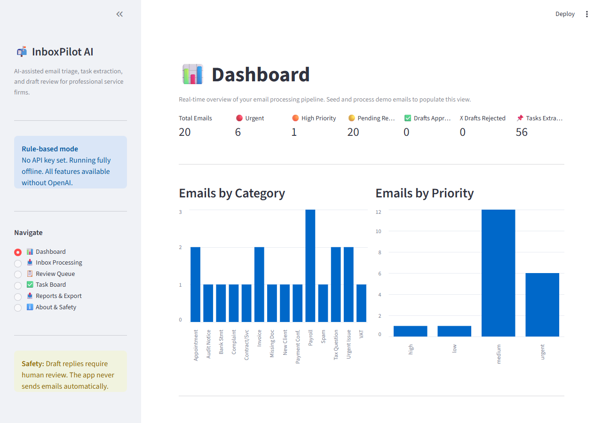
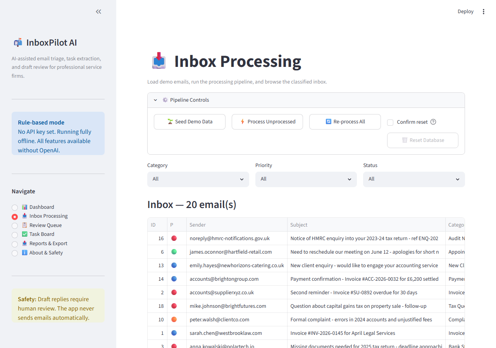
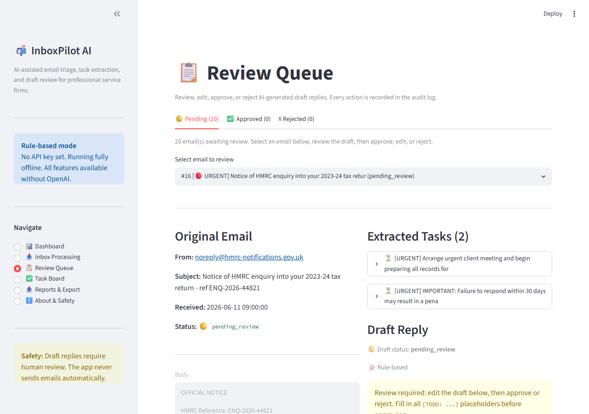
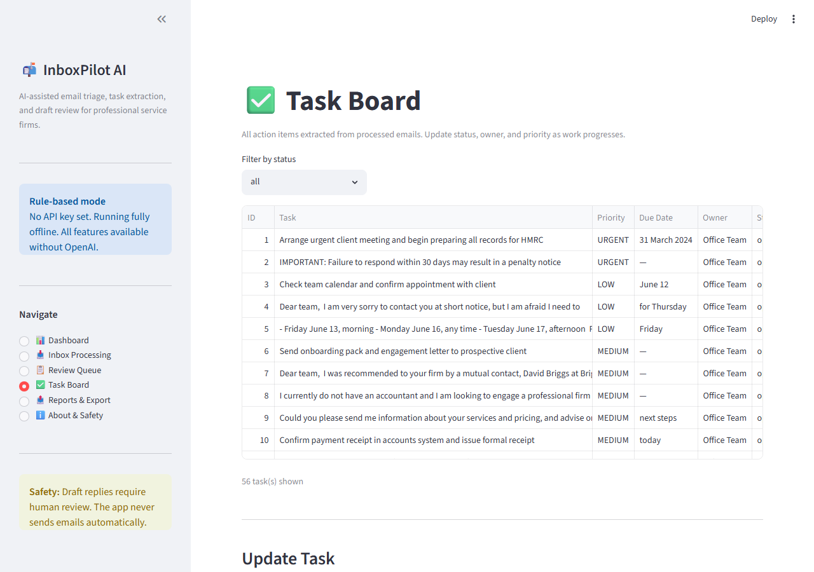
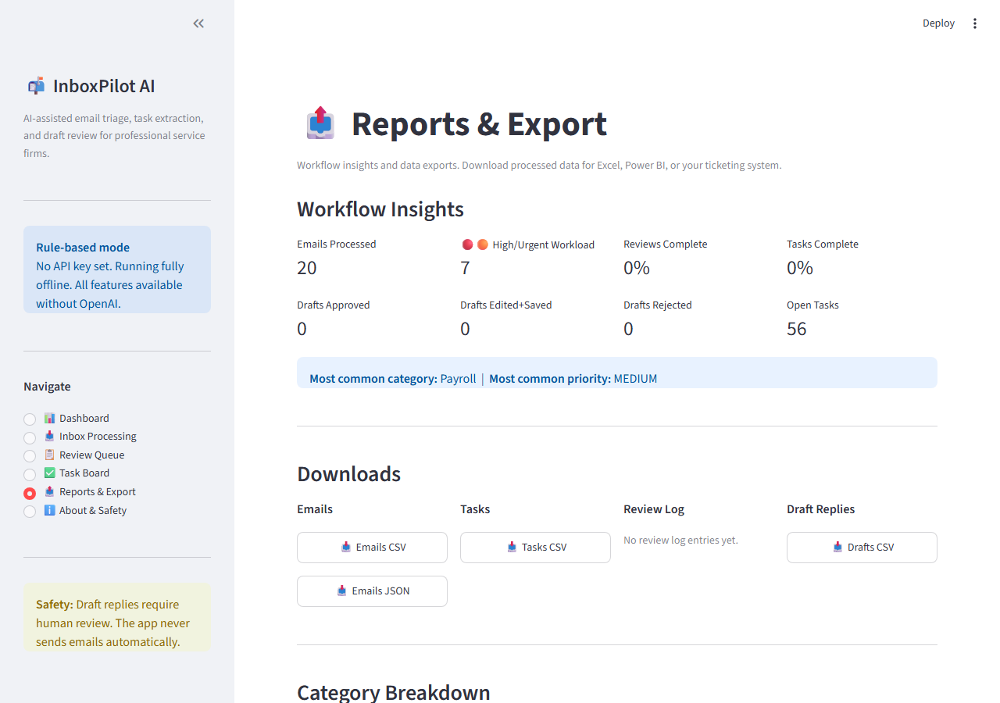
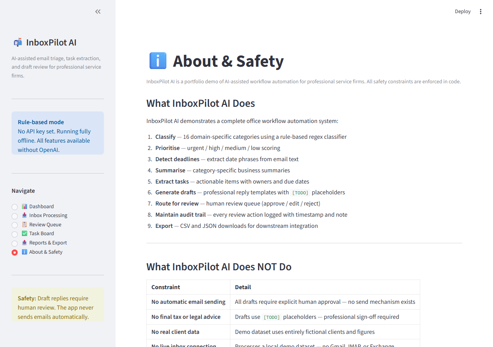
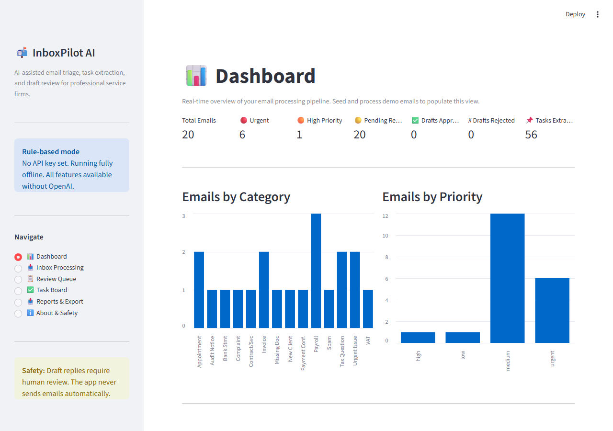

# 📬 InboxPilot AI

**An AI-assisted email workflow automation prototype for professional service firms.**

[](https://www.python.org/)
[](https://streamlit.io/)
[](tests/)
[](e2e/)
[](LICENSE)

**GitHub:** [BlerimHaxhiu/InboxPilot-AI](https://github.com/BlerimHaxhiu/InboxPilot-AI) &nbsp;|&nbsp; **Live demo:** deployment pending — see [Deployment](docs/DEPLOYMENT.md) to run locally or deploy to Streamlit Cloud.

---

## The Business Problem

Professional service firms — accounting practices, tax advisers, legal offices — receive dozens of structured client emails every day:

- Invoice submissions and payment queries
- VAT return and payroll requests
- HMRC audit notices with compliance deadlines
- Client complaints requiring urgent escalation
- Missing documents blocking ongoing work

Processing this inbox manually is slow, inconsistent, and risky. Missed deadlines have real consequences. Draft replies depend on whoever happens to handle the email. There is no audit trail. There is no task tracking.

**The challenge: automate the triage pipeline without removing human judgement from client-facing communications.**

---

## The Solution

InboxPilot AI is a complete, runnable workflow automation system that demonstrates how to build AI assistance that augments professional judgement rather than replacing it.

**Demo workflow:**

```
Demo Emails
    ↓
Processing Engine (rule-based classifier)
    ↓
Optional AI Enhancement (OpenAI GPT-4o-mini)
    ↓
Validation & Safety Layer
    ↓
SQLite Storage
    ↓
Streamlit Dashboard
    ↓
Human Review Queue → Task Board → Export Reports
```

The pipeline handles every email end-to-end:

1. **Classify** — assigns one of 16 domain-specific categories
2. **Score urgency** — urgent / high / medium / low priority
3. **Extract tasks** — actionable items with owners and due dates
4. **Detect deadlines** — regex-based date phrase extraction from body text
5. **Generate draft replies** — professional templates with `[TODO]` placeholders
6. **Route for review** — human must approve, edit, or reject every draft
7. **Log everything** — full audit trail with timestamps and reviewer notes
8. **Export** — CSV and JSON for downstream tools

---

## Key Features

| Feature | Detail |
|---|---|
| **Rule-based fallback mode** | Full pipeline runs offline with no API key — not a degraded state |
| **Optional OpenAI mode** | GPT-4o-mini enhancement when API key is set; silent fallback if it fails |
| **Human-in-the-loop review** | All drafts require explicit approval — no email is ever sent |
| **Audit trail** | Every approval, rejection, and edit logged with timestamp and note |
| **Task board** | Extracted tasks tracked through open → in progress → complete |
| **Management reports** | Workload metrics, review %, task completion %, category breakdown |
| **Data export** | CSV / JSON for emails, tasks, drafts, and review log |
| **Safety by design** | AI validation layer + safety enforcement layer on every draft |
| **222 tests** | All offline, all isolated — no API key required to run the suite |

---

## Screenshots

> Captured automatically via Playwright after seeding and processing 20 demo emails.

| Dashboard | Inbox Processing |
|---|---|
|  |  |

| Review Queue | Task Board |
|---|---|
|  |  |

| Reports & Export | About & Safety |
|---|---|
|  |  |

| Rule-Based Mode (no API key) |
|---|
|  |

---

## Tech Stack

| Component | Technology |
|---|---|
| UI | Python · Streamlit ≥1.35 (6-page sidebar navigation) |
| Database | SQLite via `sqlite3` (no server, no ORM) |
| Classification | Rule-based regex classifier (16 categories, 4 priorities) |
| AI (optional) | OpenAI GPT-4o-mini with structured JSON prompting |
| AI validation | Custom layer — normalises AI output before storage |
| Safety enforcement | Custom layer — replaces risky phrases in drafts |
| Data processing | pandas — DataFrames + CSV/JSON export |
| Testing | pytest — 222 tests, all offline, monkeypatched DB isolation |
| Config | python-dotenv — API key optional, never hardcoded |

---

## Architecture

```
┌──────────────────────────────────────────────────────────────────┐
│                       Streamlit UI  (app.py)                     │
│  Dashboard · Inbox · Review Queue · Task Board · Reports · About │
└───────────────────────────────┬──────────────────────────────────┘
                                │
               ┌────────────────▼────────────────┐
               │          Processor               │
               │  classify → extract → draft       │
               │  returns ProcessingReport         │
               └────────┬──────────────┬──────────┘
                        │              │
           ┌────────────▼───┐   ┌──────▼──────────┐
           │  Rule-based    │   │  OpenAI client  │
           │  classifier    │   │  (optional)     │
           │  draft_gen     │   │  ai_validation  │
           │  task extract  │   │  safety.py      │
           └────────────────┘   └─────────────────┘
                        │
           ┌────────────▼──────────────────────────┐
           │           SQLite  (database.py)        │
           │  emails · tasks · drafts · review_log  │
           └───────────────────────────────────────┘
```

---

## Installation

```bash
git clone https://github.com/BlerimHaxhiu/InboxPilot-AI.git
cd inboxpilot-ai

# Create virtual environment
python -m venv .venv

# Activate (Windows)
.venv\Scripts\activate

# Activate (macOS/Linux)
# source .venv/bin/activate

pip install -r requirements.txt
```

---

## Environment Setup

```bash
# Windows
copy .env.example .env

# macOS/Linux
cp .env.example .env
```

`OPENAI_API_KEY` is **optional**. Leave it empty for rule-based mode. All features work without it.

---

## Running the App

```bash
streamlit run app.py
```

Opens at `http://localhost:8501`.

---

## Running Tests

```bash
python -m pytest
```

222 tests. All offline. No API key required.

---

## Sanity Check

```bash
python scripts/sanity_check.py
```

Verifies the full pipeline end-to-end without Streamlit. Checks seeding, idempotency, processing, metrics, exports, review workflow, and task updates. Exits 0 on success.

## Browser Smoke Tests (Playwright)

Install browser engine (one-time):

```bash
python -m playwright install chromium
```

Run against a running Streamlit instance:

```bash
# Terminal 1 — start the app
streamlit run app.py --server.port 8502 --server.headless true

# Terminal 2 — run smoke tests (also captures screenshots)
python -m pytest e2e/ -v --timeout=60
```

Or use the combined runner:

```bash
python e2e/run_smoke_test.py
```

18 smoke tests verify: page loads, sidebar navigation, all 6 pages render, safety indicator present, and 7 screenshots saved to `docs/screenshots/`.

---

## Rule-Based Mode (Default)

With no API key set, the sidebar shows:
> "No API key set. Running fully offline."

All 20 demo emails are classified, tasks extracted, drafts generated, and the full review workflow operates — without any internet access or external service calls.

Rule-based mode is the primary, tested baseline — not a fallback.

---

## OpenAI-Enhanced Mode (Optional)

Set `OPENAI_API_KEY` in `.env`. Restart the app. The sidebar shows:
> "OpenAI API key detected — AI-enhanced analysis active."

GPT-4o-mini provides richer summaries, confidence scores, and contextual recommendations. Every AI response is validated and safety-checked before storage. If the API call fails, the processor falls back to rule-based silently.

---

## 5-Minute Demo Workflow

1. **📥 Inbox Processing** → Seed Demo Data → Process Unprocessed Emails
2. **📊 Dashboard** → 7 metric tiles, category and priority charts
3. **📋 Review Queue** → Select urgent email → Review draft → Fill `[TODO]` → Approve
4. **✅ Task Board** → Find extracted task → Update status to `in_progress` → Assign owner
5. **📤 Reports & Export** → Workload insights → Download Emails CSV
6. **ℹ️ About & Safety** → Safety constraints table → Human review checklist

Full guide: [`docs/DEMO_GUIDE.md`](docs/DEMO_GUIDE.md)  
Video script: [`docs/DEMO_VIDEO_SCRIPT.md`](docs/DEMO_VIDEO_SCRIPT.md)

---

## Safety Boundaries

| Constraint | How it's enforced |
|---|---|
| No automatic email sending | No send mechanism exists in the codebase |
| No final tax or legal advice | Drafts contain `[TODO]` placeholders requiring sign-off |
| No real client data | Demo dataset uses entirely fictional clients and figures |
| No live inbox connection | Local demo dataset — no Gmail, IMAP, or Exchange |
| No hardcoded credentials | API key loaded from `.env` only |
| AI output always validated | `ai_validation.py` normalises and enforces required fields |
| Drafts always safety-checked | `safety.py` replaces risky phrases before storage |
| Human review always required | `requires_human_review` forced to `True` by validation layer |

---

## Portfolio Relevance

This project demonstrates skills directly relevant to AI Automation Engineer roles:

| Skill | How demonstrated |
|---|---|
| Workflow automation | Complete email → triage → review → task → export pipeline |
| Business process thinking | 16 categories mapped to real professional services operations |
| Fallback design | Rule-based baseline; LLM upgrade path; silent fallback on failure |
| Human-in-the-loop AI | Mandatory review gate; audit log; no auto-send |
| Structured data extraction | Task extraction, deadline detection, category classification |
| Reporting and operational visibility | Workload metrics, completion %, management reports |
| LLM integration | GPT-4o-mini with structured JSON prompting, output validation |
| Safety enforcement | Two-layer safety: validation + phrase replacement before storage |
| Testing discipline | 222 tests across 10 modules; all offline; isolated test DBs |
| Code architecture | Separation of concerns; dataclasses; idempotent processing |

---

## Limitations

- **No Gmail/Outlook integration** — demo dataset only, no live inbox polling
- **No authentication** — single-user local prototype, not designed for multi-user deployment
- **SQLite** — not suitable for concurrent multi-user writes; production would use PostgreSQL
- **Static classifier** — rule-based patterns do not learn from new email types
- **GPT-4o-mini accuracy** — limited for highly ambiguous or multi-topic emails
- **Demo data only** — all clients, figures, and scenarios are fictional

---

## Future Roadmap

- Gmail / Outlook OAuth connector (replace demo seeder with live polling)
- Multi-user support with role-based review queues
- Calendar integration — booked appointments sync from email
- Vector search over historical approved replies for contextual drafting
- Approval routing with escalation rules
- Fine-tuned classifier trained on firm-specific email history
- Webhook export — push approved tasks to Jira / Trello on approval

---

## Documentation

| Doc | Description |
|---|---|
| [Architecture](docs/ARCHITECTURE.md) | Database schema, processing flow, dataclasses |
| [Demo Guide](docs/DEMO_GUIDE.md) | Step-by-step 5-minute demo with exact button clicks |
| [Demo Video Script](docs/DEMO_VIDEO_SCRIPT.md) | 2–3 minute screen recording script |
| [Portfolio Value](docs/PORTFOLIO_VALUE.md) | Technical skills demonstrated |
| [Safety & Limitations](docs/SAFETY_AND_LIMITATIONS.md) | Constraints and responsible AI design |
| [Deployment](docs/DEPLOYMENT.md) | Local setup, GitHub checklist, Streamlit Cloud |
| [Screenshots Checklist](docs/SCREENSHOTS_CHECKLIST.md) | 9 capture scenarios for portfolio |
| [Final Portfolio Report](docs/FINAL_PORTFOLIO_REPORT.md) | Complete project summary and GitHub metadata |

---

## License

MIT 
